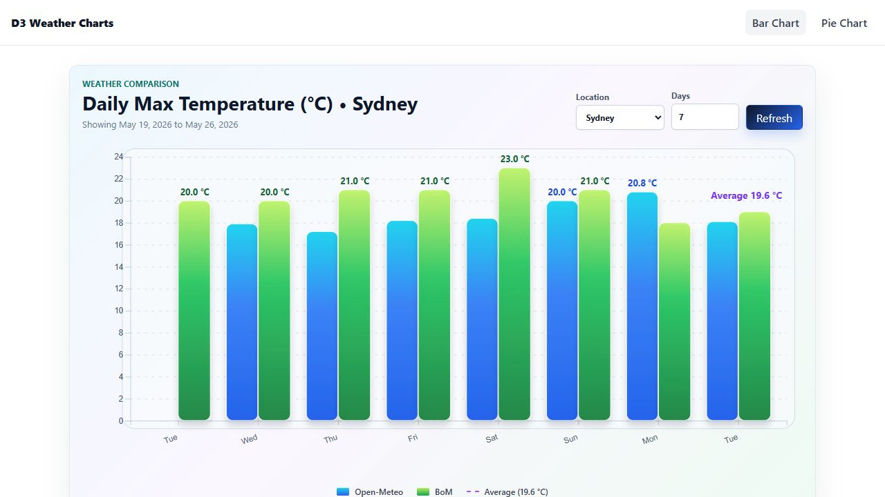
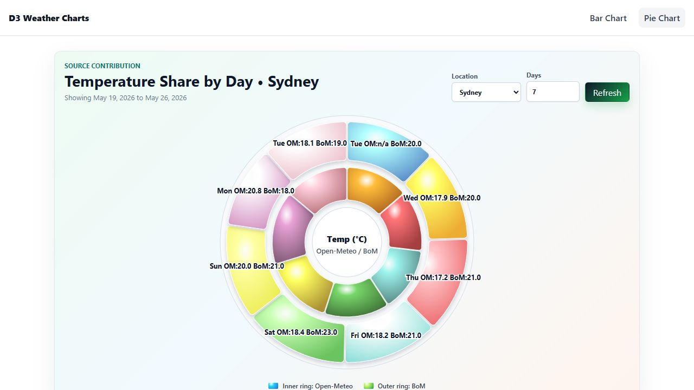
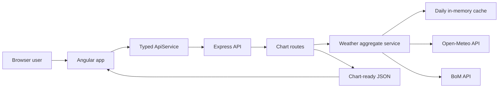

# Node Angular D3 Charts

[](https://github.com/pancakebaker/node-angular-d3-charts/actions/workflows/ci.yml)

Full-stack weather visualization demo built with an Angular frontend, D3.js charts, and a Node.js/Express API that aggregates live weather data from Open-Meteo and the Australian Bureau of Meteorology.

This repository is tuned for portfolio and interview demos: it shows data fetching, API validation, caching, typed Angular services, D3 rendering, loading/error states, and automated tests across both apps.

## Demo Preview




Optional walkthrough GIF target for a portfolio page:

```text
docs/screenshots/demo-walkthrough.gif
```

## Features

- Angular 21 frontend with route-based chart pages
- D3.js grouped bar chart and nested donut visualization
- Location and forecast-day controls for demo interaction
- Loading, empty, error, and retry states
- Node.js/Express 5 backend API
- Weather aggregation from Open-Meteo and BoM
- In-memory daily cache to reduce repeated upstream API calls
- Backend validation and Supertest route coverage
- Frontend unit tests with Angular TestBed/Vitest
- GitHub Actions CI for backend tests, frontend tests, and frontend build

## Architecture



## Project Structure

```text
node-angular-d3-charts/
  backend/
    src/
      controllers/
      helpers/
      routes/
      services/
      utils/
    tests/
  frontend/
    src/
      app/
        layout/
        pages/
        services/
```

## Requirements

- Node.js 20+ recommended
- npm 10+ recommended

Angular CLI is optional because the frontend uses npm scripts.

## Run Locally

Start the backend:

```bash
cd backend
npm install
npm start
```

The API runs at:

```text
http://localhost:3000
```

Start the frontend in another terminal:

```bash
cd frontend
npm install
npm start
```

The app runs at:

```text
http://localhost:4200
```

## Test And Build

Backend tests:

```bash
cd backend
npm test -- --runInBand
```

Frontend tests:

```bash
cd frontend
npm test -- --watch=false
```

Frontend production build:

```bash
cd frontend
npm run build
```

## API Overview

| Endpoint | Method | Description |
| --- | --- | --- |
| `/api/health` | GET | Health check |
| `/api/barchart` | GET | Chart-ready daily max temperature rows |
| `/api/piechart` | GET | Chart-ready temperature share rows |
| `/api/weather/combined` | GET | Combined normalized upstream weather payload |

Chart endpoints accept optional query params:

```text
lat=-33.8688&lon=151.2093&bomSearch=Sydney&days=7
```

Example chart row:

```json
{
  "date": "2026-05-20",
  "openMeteo": 21.5,
  "bom": 22.1
}
```

## Demo Talking Points

- The backend normalizes two external weather providers into one chart-friendly contract.
- The frontend keeps D3 isolated inside chart components while Angular owns state, routing, and API calls.
- The UI handles the unglamorous but important demo cases: loading, empty data, API failure, and refresh.
- Tests cover validation, route behavior, caching, typed API calls, and chart component state.

## What I Would Improve Next

- Add Playwright end-to-end tests that mock API responses and verify chart states visually.
- Move duplicated chart controls into a reusable Angular component.
- Add request timeouts/retry policy and structured server logging.
- Add provider attribution and last-updated metadata in the UI.
- Add a deployed demo URL and CI-generated screenshot artifacts.

## License

MIT

## Author

PancakeBaker  
Senior Full-Stack Developer  
Angular / Node.js / D3.js / TypeScript
